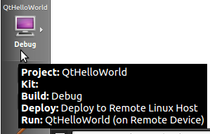
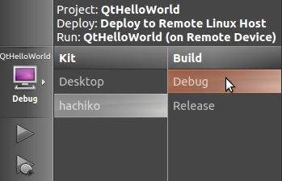
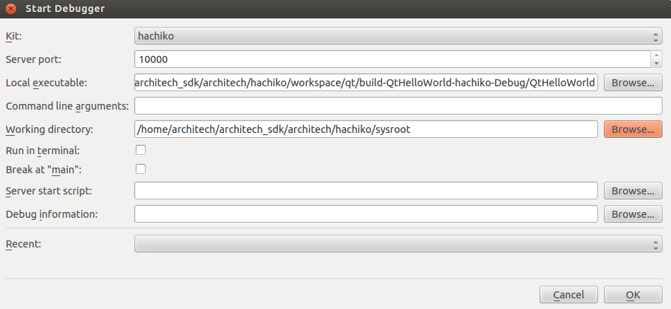

.. _qt_creator_label:

Qt Creator
==========

.. image:: _static/qt-0.png
	   :align: left

| **Qt** is a cross-platform application framework that is used to build applications. One of the best features of Qt is its capability of generating Graphical User Interfaces (GUIs).
| **Qt Creator** is a cross-platform C++ IDE which includes a visual debugger, an integrated GUI layout and form designer. It makes possible to compile and debug applications on both **x86** (host) and **ARM** (target) machines.
| This SDK relies on **version 4.8.5** of Qt and **version 2.8.1** of Qt Creator.

|
|
| Before getting our hands dirty, make sure all these steps have been followed:

1. Use :ref:`Hob <howToUseHOB>` or :ref:`Bitbake <bitbake_label>` to build an image which includes: *openssh*, support for C++, *tcf-agent* and *gdbserver*.

.. note::

 You could build *qt4e-demo-image* if you want to see the demo of Qt. Just remember to complete its file system with *tcf-agent*, *gdbserver* and *openssh*.

2. Deploy the :ref:`root file system <rootfs_label>` just generated on the final media used to boot the board

3. Replicate the same root file system into directory

.. host::

 /home/architech/architech_sdk/architech/hachiko/sysroot

4. Copy the Qt Libraries to the board media used to boot

.. host::

 | sudo mkdir -p /path/to/board/sysroot/**usr/local/Trolltech/**
 | sudo cp -r /usr/local/Trolltech/Hachiko/\* /path/to/board/sysroot/**usr/local/Trolltech/**

5. Copy the Qt Libraries to your sdk sysroot directory

.. host::

 | sudo mkdir -p ~/architech_sdk/architech/hachiko/sysroot/usr/local/Trolltech/
 | sudo cp -r /usr/local/Trolltech/Hachiko/\* ~/architech_sdk/architech/hachiko/sysroot/usr/local/Trolltech

6. Unmount the media used to boot the board from your computer and insert it into the board

7. :ref:`Power-On <poweron_label>` the board

8. Open up the :ref:`serial console <serial_console_label>`.

If you based your root file system on *qt4e-demo-image*, be sure you execute this command

.. board::

 /etc/init.d/qtdemo stop

to stop the execution of the demo application.

9. Provide a working :ref:`network <network_label>` connection between your workstation and the board (connector *XF1*), so, be sure that:

 1. your board has ip address 192.168.0.10 on interface eth0, and

 2. your PC has an ip address in the same family of addresses, e.g. 192.168.0.100. 

Hello World!
------------

The purpose of this example project is to generate a form with an "Hello World" label in it, at the beginning on the x86 virtual machine and than on Hachiko/SDRAM board.

To create the project follow these steps:

1. Use the **Welcome Screen** to run Qt Creator by selecting *Architech→Hachiko/SDRAM→Develop with Qt Creator*

.. image:: _static/qtCreatorStart.png

2. Go to *File -> Open File or Project* to open **QtHelloWorld.pro** file located in */home/architech/architech_sdk/architech/hachiko/workspace/qt/QtHelloWorld/* directory.

3. Click on "QtHelloWorld" icon to open project menu.

4. Select the build configuration: **Desktop - Debug**.

.. image:: _static/qt-2.png

5. To build the project, click on the bottom-left icon.

.. image:: _static/qt-3.png

6. Once you built the project, click on the green triangle to run it.

.. image:: _static/qt-4.png

7. Congratulations! You just built your first Qt application for x86.

.. image:: _static/qt-5.png

In the next section we will debug our Hello World! application directly on Hachiko/SDRAM.

Debug Hello World project
-------------------------

8. Select build configuration: **hachiko - Debug** and build the project.

9. Copy the generated executable to the target board (e.g /home/root/).

.. host::

  scp /home/architech/architech_sdk/architech/hachiko/workspace/qt/build-QtHelloWorld-Hachiko-Debug/QtHelloWorld root@192.168.0.10:/home/root

10. Use minicom to launch gdbserver application on the target board:

.. board::

  gdbserver :10000 QtHelloWorld -qws

11. | In Qt Creator, open the source file main.cpp and set a breakpoint at line 6. 
    | To do this go with the mouse at line 6 and click with the right button to open the menu, select **Set brackpoint at line 6**

.. image:: _static/qt-6.png

12. Go to *Debug→Start Debugging→Attach To Remote Debug Server*, a form named "Start Debugger" will appear, insert the following data:

- Kit: **hachiko**

- Local executable: **/home/architech/architech_sdk/architech/hachiko/workspace/qt/build-QtHelloWorld-hachiko-Debug/QtHelloWorld**

Press **OK** button to start the debug.

.. image:: _static/qt-8.png

13. The hotkeys to debug the application are:

- **F10**: Step over

- **F11**: Step into

- **Shift + F11**: Step out

- **F5**: Continue, or press this icon:

.. image:: _static/qt-9.png

14. To successfully exit from the debug it is better to close the graphical application from the target board with the mouse by clicking on the 'X' symbol. 

